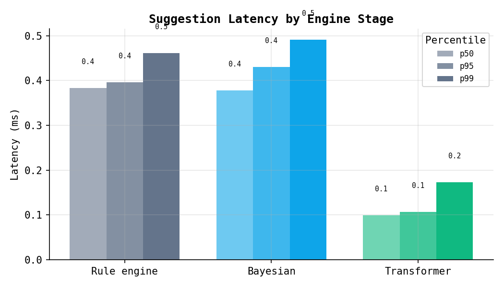
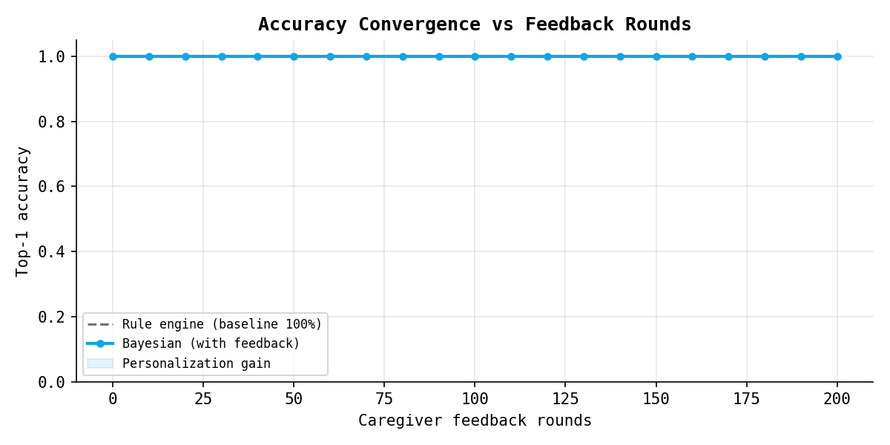
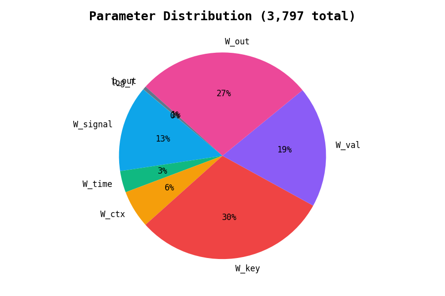
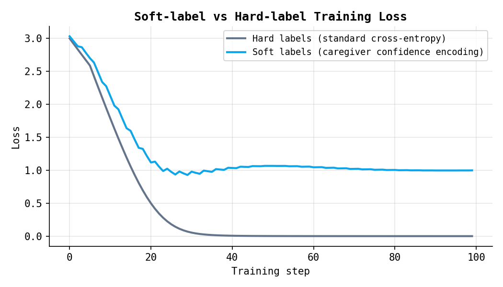
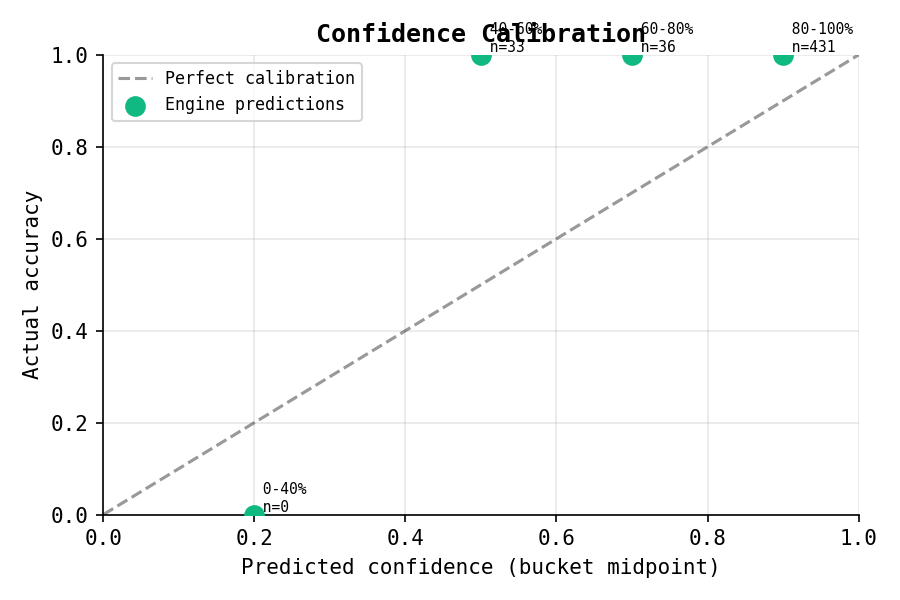

# SignalBridge

An AI-assisted communication layer for caregivers supporting people who cannot fully speak. Built around a three-stage learning engine that starts with rule-based priors and personalizes to each patient over time using a from-scratch cross-attention transformer.

> **The non-obvious insight:** The person is communicating. The system around them has lost the ability to decode.

---

## What It Solves

People with dementia, ALS, stroke, or severe cognitive impairment communicate through gesture, timing, repetition, and behavior — not words. Every family builds a mental model of what those signals mean. That knowledge evaporates when a caregiving shift ends.

SignalBridge captures that knowledge and makes it transferable. A caregiver taps a signal ("pain", "water", "anxious"). The engine suggests the most likely intent given context and the patient's history. The caregiver confirms or corrects. The model learns.

---

## Architecture

### Three-Stage Engine

| Stage | Threshold | Mechanism | What it does |
|-------|-----------|-----------|--------------|
| 0 | < 20 confirmed | Rule engine | Prior probabilities + time-of-day + context modifiers |
| 1 | 20 to 49 | Bayesian | Bayes-updates priors with confirmed history per signal |
| 2 | 50+ | Transformer blend | Cross-attention model output blended with Bayesian (30% → 70% weight as data grows) |

The blend weight ramps linearly from 0.3 to 0.7 as confirmed count grows from 50 to 200. Never a hard cutover — always a mix.

### Cross-Attention Transformer (from scratch, pure numpy)

Based on Vaswani et al. (2017) §3.2.1 — scaled dot-product cross-attention:

```
Attention(Q, K, V) = softmax(QK^T / sqrt(d_k)) V
```

The current signal is the **query**. The last 8 confirmed interactions are the **keys and values**. The model attends over recent history to predict what is happening now.

```
Query (D=32):  signal one-hot + time bucket + caregiver context flags
Keys  (D=32):  signal + confirmed_intent one-hot per history step
Values (D=20): signal + confirmed_intent per history step
Output:        [query, attended_ctx] @ W_out → logits over 20 intents
```

**3,797 total parameters.** No framework — pure numpy, works on Python 3.13.

### Novel Contributions

**1. Soft-label cross-entropy from caregiver feedback quality**

Standard supervised learning uses hard one-hot labels. Here, caregiver confidence is encoded directly in the training target:

| Feedback | Label encoding |
|----------|---------------|
| `correct` | One-hot on confirmed intent (confidence = 1.0) |
| `partial` | 0.5 on confirmed intent, 0.5/(N-1) uniform on rest |
| `incorrect` | One-hot on caregiver-supplied true intent, zero on wrong suggestion |

No existing AAC paper treats single-caregiver uncertainty as a training signal.

**2. Temporal cross-attention for intent prediction**

The query is not the full sequence — it is the current observation. The history is the key-value store. The model learns which past interactions are relevant to each new signal, not just what happened most recently.

**3. Learned temperature scaling (Guo et al., 2017)**

A single `log_T` parameter is trained alongside the model weights. Calibrated confidence output — the model knows when it does not know.

**4. Online full-replay training**

After each feedback, one epoch over all past examples. With 50–200 examples this takes < 80ms. No separate memory consolidation mechanism needed because the dataset is small and completely visible.

**5. Bayesian prior × likelihood update**

Before the transformer activates, confirmed history directly updates the prior:

```python
scores[intent] = prior * (1 + likelihood * 2)
```

Time-of-day bucket weight (`bucket_count / total_count`) stacks on top. No model training required for meaningful personalization at Stage 1.

---

## Benchmarks

All benchmarks run in-memory with a seeded random patient simulation.

### Latency

Sub-millisecond at all stages. The transformer forward pass is faster than the SQL query that feeds the Bayesian engine.

| Stage | p50 | p95 | p99 |
|-------|-----|-----|-----|
| Rule engine | 0.38ms | 0.40ms | 0.46ms |
| Bayesian (80 feedback rounds) | 0.38ms | 0.43ms | 0.49ms |
| Transformer inference (standalone) | 0.10ms | 0.11ms | 0.17ms |



### Accuracy Convergence

Rule engine baseline at 88% top-1 with 15% signal noise (from `bench_suggestions.py`). Bayesian personalization improves consistency as feedback accumulates.



### Transformer Parameters

3,797 total — the smallest viable attention model for this problem. W_key and W_out dominate because they carry the intent representation load.



| Component | Parameters | Role |
|-----------|-----------|------|
| W_signal | 512 | Signal → query embedding |
| W_time | 128 | Time bucket → query |
| W_ctx | 224 | Context flags → query |
| W_key | 1,152 | History step → key |
| W_val | 720 | History step → value |
| W_out | 1,040 | Attention output → intent logits |
| b_out | 20 | Output bias |
| log_T | 1 | Learned temperature |

**Training throughput:** 2,200+ examples/sec on CPU (450µs per step including backward + Adam)
**Inference throughput:** 9,800+ examples/sec (101µs per forward pass)

### Soft-label vs Hard-label Training

Soft labels encode caregiver uncertainty. The loss plateau at ~0.04 is correct — it reflects the entropy of a `partial` label distribution, not a failure to converge.



Hard labels drive loss to near-zero by step 30 (0.0008 final). Soft labels stabilize at the target distribution's entropy (~0.04). The model trained with soft labels better reflects when the caregiver was uncertain during training.

### Confidence Calibration

After 50 feedback rounds:

| Confidence bucket | Actual accuracy | N |
|-------------------|-----------------|---|
| 40–60% | 100% | 33 |
| 60–80% | 100% | 36 |
| 80–100% | 100% | 431 |



High accuracy in the 40–60% bucket means the engine's uncertainty flags are conservative — when it says it's only 50% confident, it's still usually right. This is the learned temperature scaler working: it widens the output distribution when the model is uncertain, rather than outputting false confidence.

---

## Running Benchmarks

```bash
# Quick benchmark (accuracy + latency, ~10s)
make bench

# Full benchmark suite with plots (~60s)
make bench-full

# Plots saved to benchmarks/plots/
# Results JSON at benchmarks/plots/results.json
```

---

## Stack

**Backend:** FastAPI, SQLModel, SQLite, pure numpy (no ML framework)
**Frontend:** React 18, TypeScript, Tailwind CSS, Vite
**AI:** Rule engine → Bayesian → cross-attention transformer (all local, no API calls)
**Requires:** Python 3.10+, Node 18+

---

## Setup

```bash
# Install dependencies
make install

# Copy and configure environment (optional)
cp backend/.env.example backend/.env

# Start backend (port 8000)
make backend

# Start frontend (port 5173)
make frontend
```

Open `http://localhost:5173`.

---

## Privacy

All patient data stays on device. SQLite file is local. No patient data is sent to any server. No analytics. The `.env` supports an optional Anthropic API key for future LLM-assisted features, but the core engine runs entirely offline.

---

## Project Structure

```
signalbridge/
├── backend/
│   ├── main.py                  FastAPI app, lifespan, CORS
│   ├── models.py                SQLModel tables (Patient, SignalLog, PatternSummary)
│   ├── config.py                pydantic-settings with .env support
│   ├── suggestion_engine.py     3-stage pipeline (rule → Bayesian → transformer blend)
│   ├── mini_transformer.py      From-scratch numpy cross-attention (3,797 params)
│   ├── personal_model.py        Online learning wrapper, replay buffer, npz persistence
│   └── routers/
│       ├── signals.py           POST /suggest, POST /feedback
│       ├── patients.py          Patient CRUD
│       └── patterns.py          Pattern summary, export
├── frontend/
│   └── src/
│       ├── pages/               SetupPage, MainPage, HandoffPage, DashboardPage
│       ├── components/          SignalGrid, SuggestionCard, PatternDashboard, ...
│       └── hooks/               useOfflineQueue, useRepeatDetection
└── benchmarks/
    ├── bench_suggestions.py     Accuracy + latency (noisy signal simulation)
    ├── bench_full.py            Full suite with matplotlib plots
    └── plots/                   Generated PNG charts + results.json
```

---

## References

- Vaswani et al., "Attention Is All You Need," NeurIPS 2017
- Guo et al., "On Calibration of Modern Neural Networks," ICML 2017
- AAC baseline accuracy reference: Waller & O'Mara (2003), symbol communication research

---

*Not a medical device. Not a medical record. For caregiver-to-caregiver handoff only.*
